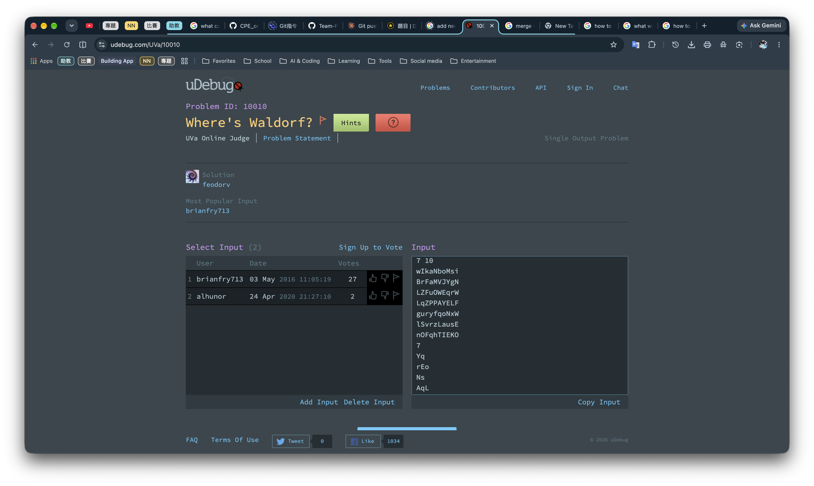
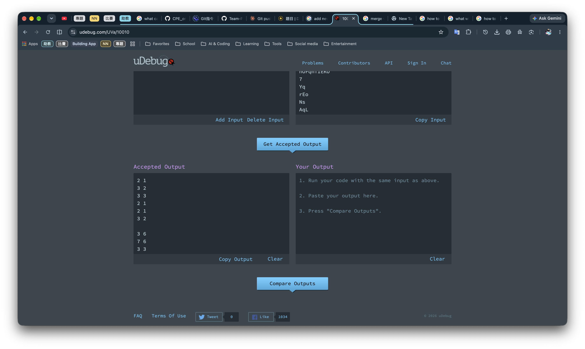

# Testing Data

> *The Testing Data are from the uDebug website: https://www.udebug.com/ .*

## Rules

**More test cases are always better but**:
- Min number of test cases for each problem: 1
- Max number of test cases for each problem: 7

**Input**: from `Input`
**Output**: from `Accepted Output`

## Example

**Select Input**: they are test cases
**Input**: the input of each test case

**Accepted Output**: the output of each test case
> But you need to press the `Get Accepted Output` button to get the output.

## Example Result

[./example.md](./example.md)